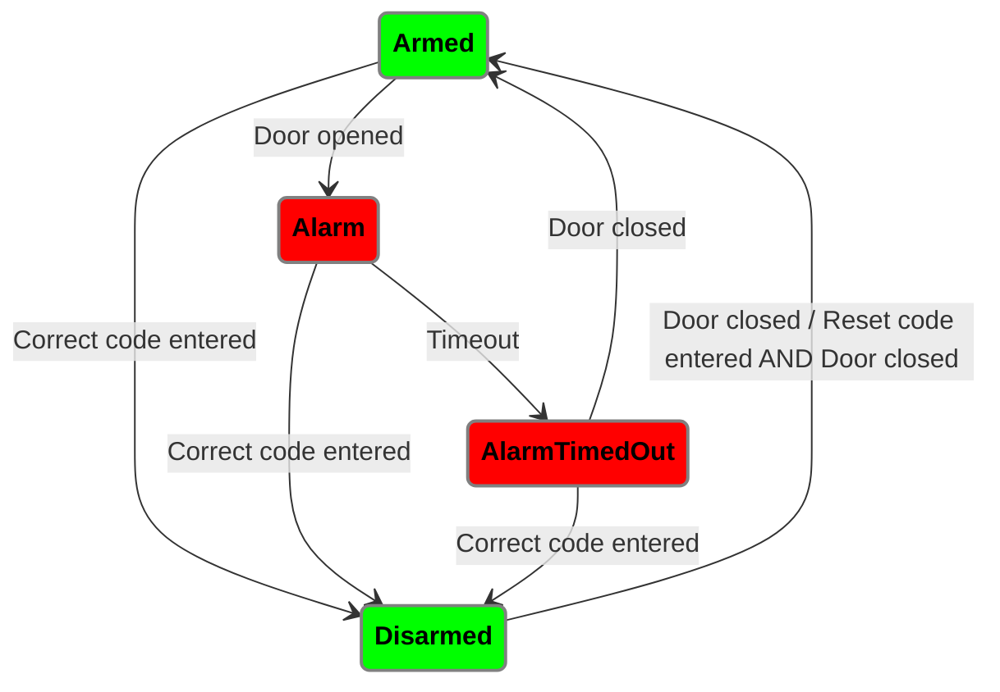

# Introduction
We have a small shelter on our property were we keep our bikes. 
Sadly, we had 4 occasions at which 5 bikes had been stolen throughout the last 9 years.
As the years went by, I upgraded the sheds physical security features: 
- better locks
- o-ring within the shelter to additionally lock the bikes
So far nothing helped and we thus stored two of the bikes inside the house.

This project is the next escalation phase, and implements a Raspberry-Pi based alarm system.
It features an audible alarm and two 15.000 LED lumen blinding lights, so that if a theft enters the shelter he will be blinded for a small duration of time.

# Hardware:
- Raspberry PI 3B
- 4 Channel Relais
- Alarm Signal
- Window-/Door contact sensor
- Keypad

# Alarm rules 
The following depicts how the state machine is implemented. 

